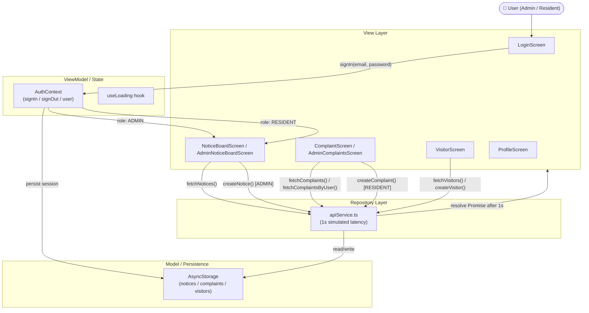

# Horizon Society Connect

> **A robust community management solution** built for Horizon Broadband's technical assessment.
> Designed and implemented following the Senior Mobile Systems Architect specification.

---

## Project Overview

**Horizon Society Connect** is a React Native (Expo) mobile application that enables seamless community management for residential societies. The platform serves two distinct personas — **Residents** and **Administrators** — each with role-appropriate features protected by a robust authentication layer.

Key capabilities include:
- 📋 **Notice Board** — Post and view community announcements with priority and category classification
- 🛠 **Complaint Management** — Raise, track, and administer complaints with status visibility
- 👤 **Visitor Pre-approval** — Residents generate secure 4-digit entry codes for expected visitors
- 🔐 **Role-Based Access** — Admin and Resident flows are strictly separated via AuthContext and navigation guards

---

## Architecture

> **Modular MVVM with Repository Pattern for data abstraction**

```
┌─────────────────────────────────────┐
│              App.tsx                │  ← PaperProvider + AuthProvider
├─────────────────────────────────────┤
│           AppNavigator              │  ← AuthGate HOC (navigation switch)
├──────────────────┬──────────────────┤
│    AuthStack     │     MainTabs     │  ← Role-based tab routing
│  (LoginScreen)   │  (Home/Complaints│
│                  │  /Visitors/Profile│
├──────────────────┴──────────────────┤
│              Screens                │  ← View layer (MVVM: View)
├─────────────────────────────────────┤
│           Shared Components         │  ← NoticeCard, ComplaintItem, etc.
├─────────────────────────────────────┤
│          Context / Hooks            │  ← AuthContext, useLoading (ViewModel)
├─────────────────────────────────────┤
│        API Service (Repository)     │  ← apiService.ts — data abstraction
├─────────────────────────────────────┤
│        AsyncStorage (Model)         │  ← Persistent local store
└─────────────────────────────────────┘
```

### Directory Structure

```
HorizonSocietyConnect/
├── App.tsx                      # Root component
├── app.json                     # Expo configuration
├── babel.config.js              # NativeWind babel plugin
├── tailwind.config.js           # Tailwind CSS tokens
├── tsconfig.json                # TypeScript strict mode
└── src/
    ├── api/
    │   └── apiService.ts        # Mock repository — simulates network latency
    ├── components/
    │   └── common/
    │       ├── ComplaintItem.tsx # Status chip + progress bar
    │       ├── EmptyState.tsx   # Lucide icon empty state
    │       ├── LoadingOverlay.tsx # Full-screen activity indicator
    │       └── NoticeCard.tsx   # Color-coded category/priority badges
    ├── context/
    │   └── AuthContext.tsx      # Session management + role-based auth
    ├── hooks/
    │   └── useLoading.ts        # Generic async loading state hook
    ├── navigation/
    │   ├── AppNavigator.tsx     # Root AuthGate navigator
    │   ├── AuthStack.tsx        # Unauthenticated flow
    │   └── MainTabs.tsx         # Bottom tab navigator (role-aware)
    ├── screens/
    │   ├── AdminComplaintsScreen.tsx  # Admin: all complaints + stats
    │   ├── AdminNoticeBoardScreen.tsx # Admin: notices + FAB create modal
    │   ├── ComplaintScreen.tsx        # Resident: submit + view own complaints
    │   ├── LoginScreen.tsx            # Auth entry point
    │   ├── NoticeBoardScreen.tsx      # Resident: view notices
    │   ├── ProfileScreen.tsx          # User profile + sign out
    │   └── VisitorScreen.tsx          # Resident: visitor pre-approval
    ├── theme/
    │   └── colors.ts            # Material Design color palette
    └── types/
        └── index.ts             # All TypeScript domain interfaces
```

---

## Tech Stack

| Technology | Purpose |
|---|---|
| **React Native** | Cross-platform mobile framework |
| **Expo** | Managed workflow, OTA updates |
| **TypeScript** | Static typing, safer refactoring |
| **React Native Paper** | Material Design 3 component library |
| **React Navigation** | Stack + Bottom Tab navigators |
| **AsyncStorage** | Offline-first persistent storage |
| **NativeWind** | Tailwind CSS utility classes for RN |
| **Lucide React Native** | Consistent icon library |

---

## Data Flow Diagram



---

## Key Features

### 🔐 Role-Based Access Control
- **Admin** credentials: `admin@horizon.com` / `admin123`
  - Can post notices via FAB + modal
  - Sees ALL residents' complaints with stats dashboard
- **Resident** credentials: `user@horizon.com` / `user123`
  - Views community notices (read-only)
  - Raises and tracks own complaints only
  - Pre-approves visitors with generated entry codes
- Session persisted via AsyncStorage — survives app restarts

### 📋 Notice Board
- Color-coded badges by **category** (Maintenance 🔴, Event 🟣, General 🔵)
- Priority indicators (High / Low)
- Admin FAB opens a bottom-sheet modal with SegmentedButtons for category/priority
- Pull-to-refresh for updated notice list

### 🛠 Complaint Management
- Residents submit complaints with title + description
- Each complaint stored in AsyncStorage (offline-first)
- Status chip + progress bar for `PENDING` (35%) / `RESOLVED` (100%)
- Admins see all complaints with aggregate stats (Total / Pending / Resolved)

### 👤 Visitor Pre-approval
- Resident enters visitor name + expected date
- System auto-generates a **4-digit numeric entry code**
- Active pre-approvals shown in a **horizontal scroll** card list
- Entry code displayed prominently in each visitor card

### ⚡ UX Polish
- `LoadingOverlay` — full-screen modal with activity indicator for all API calls
- `EmptyState` — Lucide icon + descriptive text when lists are empty
- `Alert.alert()` — success/error feedback for all mutations
- Pull-to-refresh on all list screens

---

## Setup Instructions

### Prerequisites
- Node.js ≥ 18
- npm ≥ 9
- Expo CLI: `npm install -g expo-cli`
- Expo Go app on your phone OR an Android/iOS simulator

### Step 1 — Install Dependencies
```bash
cd HorizonSocietyConnect
npm install --legacy-peer-deps
```

### Step 2 — Start the Development Server
```bash
npx expo start
```

### Step 3 — Run on Device
- **Expo Go (Recommended)**: Scan the QR code displayed in the terminal with the Expo Go app
- **Android Simulator**: Press `a` in the terminal
- **iOS Simulator**: Press `i` in the terminal (macOS only)

---

## Engineering Decisions

### Why AsyncStorage?
**Offline-first capability** — AsyncStorage provides synchronous-feeling, persistent local storage that works without any network connection. For a community app that residents use in areas with spotty connectivity, this ensures complaints and visitor pre-approvals are never lost. The Repository Pattern (`apiService.ts`) wraps all AsyncStorage operations, meaning a real API can be swapped in without touching any screen or component code.

### Why the Repository Pattern?
**API readiness and testability** — By funneling all data operations through `apiService.ts`, the application achieves complete decoupling between the UI and data source. The 1-second `setTimeout` simulation in every service method trains the UI to handle async states (loading, success, error) from day one. Replacing the mock with a real REST or GraphQL client requires changes in exactly one file.

### Why React Native Paper?
**Material Design 3 compliance out-of-the-box** — Paper provides accessible, customizable components (Chip, ProgressBar, FAB, SegmentedButtons, TextInput) that adhere to MD3 guidelines without custom styling overhead. Its `PaperProvider` theme system allows global color tokens to propagate through the component tree.

### Why NativeWind alongside Paper?
**Utility-first layout with component-library semantics** — NativeWind handles structural layout (flex, margins, padding, border-radius) via Tailwind classes, while Paper handles interactive component states. This prevents style duplication and maintains consistency with the shared Tailwind token system.

---

## Git Commit History

| Commit | Message |
|---|---|
| 1 | `chore: initial project scaffold with architecture layers` |
| 2 | `feat: define domain models and implement role-based auth context` |
| 3 | `feat: implement navigation strategy and auth-guarded routing` |
| 4 | `feat: implement mock repository pattern with simulated network latency` |
| 5 | `feat: implement resident-facing features: notices and complaint raising` |
| 6 | `feat: implement admin-facing features: notice management and oversight` |
| 7 | `ui: enhance UX with loading states, empty states, and material design polish` |
| 8 | `docs: finalize technical documentation and architecture overview` |

