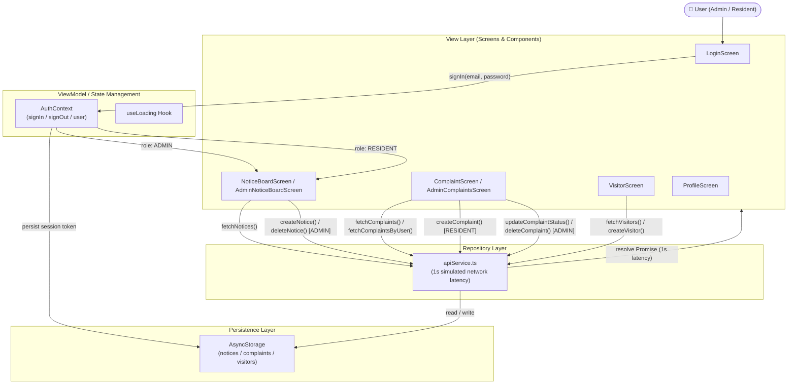

# Horizon Society Connect

> **A robust community management solution** built for Horizon Broadband's technical assessment.  
> Designed and implemented following the Senior Mobile Systems Architect specification.

---

## Project Overview

**Horizon Society Connect** is a cross-platform React Native (Expo) application that enables seamless community management for residential societies. The platform serves two distinct personas — **Residents** and **Administrators** — each with role-tailored capabilities guarded by a typed authentication layer.

### Key Capabilities
- 📋 **Notice Board** — Post, view, and administer community announcements with category and priority classification
- 🛠 **Complaint Management** — Raise, track, resolve, and clear complaints with live progress indicators and aggregate statistics
- 👤 **Visitor Pre-approval** — Residents generate secure 4-digit entry codes for expected visitors with horizontal card tracking
- 🔐 **Role-Based Access Control** — Strict separation between Resident and Administrator flows via `AuthContext` and navigation guards
- 🌐 **Cross-Platform Support** — Fully tested on Android (Expo Go / Hermes) and Desktop Web browsers

---

## Architecture

> **Modular MVVM with Repository Pattern for complete data abstraction**

```
┌────────────────────────────────────────────────────────┐
│                        App.tsx                         │  ← PaperProvider + AuthProvider (Global Theme)
├────────────────────────────────────────────────────────┤
│                      AppNavigator                      │  ← AuthGate HOC (Conditional Route Switch)
├───────────────────────────┬────────────────────────────┤
│         AuthStack         │          MainTabs          │  ← Dynamic Role-Aware Tab Navigator
│       (LoginScreen)       │   (Notices/Complaints/     │
│                           │    Visitors/Profile)       │
├───────────────────────────┴────────────────────────────┤
│                     Screen Views                       │  ← View Layer (MVVM: View)
├────────────────────────────────────────────────────────┤
│                  Reusable Components                   │  ← NoticeCard, ComplaintItem, EmptyState, etc.
├────────────────────────────────────────────────────────┤
│                     Context & Hooks                    │  ← AuthContext, useLoading (ViewModel)
├────────────────────────────────────────────────────────┤
│                API Service (Repository)                │  ← apiService.ts (1-second Simulated Latency)
├────────────────────────────────────────────────────────┤
│                 AsyncStorage (Model)                   │  ← Offline-First Persistent Storage
└────────────────────────────────────────────────────────┘
```

### Directory Structure

```
.
├── App.tsx                      # Root component (Providers & Theme Injection)
├── app.json                     # Expo SDK configuration
├── babel.config.js              # Babel preset configuration
├── tailwind.config.js           # Horizon brand design tokens
├── tsconfig.json                # TypeScript strict configuration
└── src/
    ├── api/
    │   └── apiService.ts        # Mock repository with 1-second simulated network latency
    ├── components/
    │   └── common/
    │       ├── ComplaintItem.tsx # Status chip, progress bar & admin action triggers
    │       ├── EmptyState.tsx   # Lucide icons + contextual empty messaging
    │       ├── LoadingOverlay.tsx # Full-screen modal activity indicator
    │       └── NoticeCard.tsx   # Color-coded category & priority chips + admin delete
    ├── context/
    │   └── AuthContext.tsx      # Role-based session state & AsyncStorage persistence
    ├── hooks/
    │   └── useLoading.ts        # Generic async operation loading state hook
    ├── navigation/
    │   ├── AppNavigator.tsx     # Root AuthGate navigation controller
    │   ├── AuthStack.tsx        # Unauthenticated stack (Login)
    │   └── MainTabs.tsx         # Bottom tab navigator with role-conditioned screens
    ├── screens/
    │   ├── AdminComplaintsScreen.tsx  # Admin: stats overview, mark fixed & clear complaints
    │   ├── AdminNoticeBoardScreen.tsx # Admin: notice feed, creation modal & notice deletion
    │   ├── ComplaintScreen.tsx        # Resident: raise complaints & view personal history
    │   ├── LoginScreen.tsx            # Form validation, demo credentials & role dispatch
    │   ├── NoticeBoardScreen.tsx      # Resident: view announcements (read-only)
    │   ├── ProfileScreen.tsx          # Account details, role badge & cross-platform sign-out
    │   └── VisitorScreen.tsx          # Resident: 4-digit code generator & horizontal card list
    ├── theme/
    │   └── colors.ts            # Material Design 3 palette (#1E40AF Primary, #F59E0B Accent)
    └── types/
        └── index.ts             # Domain models (User, Notice, Complaint, Visitor)
```

---

## Tech Stack

| Technology | Purpose |
|---|---|
| **React Native** | Cross-platform mobile framework (Hermes runtime) |
| **Expo** | Managed development workflow & OTA runtime (SDK 57) |
| **TypeScript** | Static type safety and domain model contracts |
| **React Native Paper** | Material Design 3 UI component system |
| **React Navigation** | Native Stack + Bottom Tabs navigators |
| **AsyncStorage** | Offline-first persistent local data storage |
| **NativeWind** | Tailwind CSS utility-first styling |
| **Lucide React Native** | Clean vector icon system |

---

## Data Flow Diagram



---

## Key Features

### 🔐 Role-Based Authentication & Guarding
- **Admin Persona** (`admin@horizon.com` / `admin123`):
  - Post notices via floating action button (FAB) with priority/category tags
  - Delete notices directly from the board
  - View aggregate stats banner (Total, Pending, Resolved)
  - Mark complaints as `RESOLVED` (progress updates to 100%) or permanently clear them
- **Resident Persona** (`user@horizon.com` / `user123`):
  - Read-only access to community announcements
  - Submit complaints and track personal complaints with status indicators
  - Pre-approve visitors and generate 4-digit access codes
- **Session Persistence**: Stored via `AsyncStorage`, automatically rehydrated upon launch.

### 📋 Notice Board & Categorization
- Color-coded category chips (Maintenance 🔴, Event 🟣, General 🔵)
- Priority indicators (High 🔴, Low 🟢)
- Admin bottom-sheet creation modal with `SegmentedButtons`
- Pull-to-refresh on all views

### 🛠 Complaint Lifecycle Management
- Residents submit complaints with real-time validation
- Status chips with color cues and progress bars (`PENDING`: 35% | `RESOLVED`: 100%)
- Filtered data access: Residents only see their own tickets; Administrators view all tickets
- Admin resolution & clear workflows with confirmation safety checks

### 👤 Visitor Pre-Approval
- Resident input for visitor name and expected arrival date
- Automatic generation of secure **4-digit numeric access codes**
- Active visitor badges presented in a horizontal scroll card layout

### ⚡ UX & Cross-Platform Polish
- `LoadingOverlay`: Full-screen activity modal during simulated 1-second network operations
- `EmptyState`: Contextual vector icons and guidance when lists are empty
- Cross-platform dialogs: Native alerts on Android; non-blocking confirmation dialogs on Web
- Pull-to-refresh support across all feeds

---

## Setup & Running the Application

### Prerequisites
- **Node.js** ≥ 20.19.4 (Node.js 22 LTS recommended)
- **npm** ≥ 9
- **Expo Go** mobile app (Android / iOS)

### 1. Install Dependencies
```bash
npm install --legacy-peer-deps
```

### 2. Run the Development Server

#### Option A: On Mobile (Expo Go)
```bash
npx expo start -c
```
- Connect your phone to the same Wi-Fi network as your computer.
- Open **Expo Go** on Android and scan the displayed QR code.

#### Option B: In Desktop Web Browser
```bash
npx expo start --web
```
- Automatically opens the application at `http://localhost:8081`.

---

## Engineering Decisions

### Why AsyncStorage?
**Offline-first resilience** — `AsyncStorage` provides reliable local persistence without requiring active internet connectivity. In residential settings with inconsistent basement or lobby coverage, complaints and visitor codes remain preserved. Funneling all storage through `apiService.ts` ensures complete API abstraction.

### Why the Repository Pattern?
**Decoupling and testability** — The UI layer interacts exclusively with `apiService.ts` asynchronous interfaces. Simulated 1-second network latency trains the presentation layer to manage loading, error, and resolved states cleanly. Transitioning from local storage to a live GraphQL or REST backend requires modifications strictly inside `apiService.ts`.

### Why React Native Paper (MD3)?
**Accessible, production-grade Material Design** — Paper supplies battle-tested components (FAB, Chip, Modal, SegmentedButtons, ProgressBar) built to Material Design 3 guidelines. The unified theme provider ensures brand color consistency across all screens.

### Why NativeWind with Paper?
**Utility-first ergonomics** — NativeWind handles responsive layout, flexbox, spacing, and structural geometry, while Paper handles interactive component states. This hybrid approach prevents verbose style boilerplate while keeping component accessibility intact.

---

## Git Commit History

| # | Message | Description |
|---|---|---|
| 1 | `chore: initial project scaffold with architecture layers` | Project layout, config files, theme tokens, and base dependencies |
| 2 | `feat: define domain models and implement role-based auth context` | TypeScript contracts (`User`, `Notice`, `Complaint`, `Visitor`) & `AuthContext` |
| 3 | `feat: implement navigation strategy and auth-guarded routing` | `AppNavigator` AuthGate, `AuthStack`, and role-aware `MainTabs` |
| 4 | `feat: implement mock repository pattern with simulated network latency` | `apiService.ts` with 1-second simulated latency & `useLoading` hook |
| 5 | `feat: implement resident-facing features: notices and complaint raising` | `LoginScreen`, `NoticeBoardScreen`, and resident `ComplaintScreen` |
| 6 | `feat: implement admin-facing features: notice management and oversight` | `AdminNoticeBoardScreen` with FAB modal & `AdminComplaintsScreen` dashboard |
| 7 | `ui: enhance UX with loading states, empty states, and material design polish` | Shared components (`NoticeCard`, `ComplaintItem`, `EmptyState`, `LoadingOverlay`) & `VisitorScreen` |
| 8 | `docs: finalize technical documentation and architecture overview` | Initial architectural documentation, technical decisions, and Mermaid diagrams |
| 9 | `fix: resolve expo config plugin, fix main entry point, and enable web runtime` | Removed invalid plugin declaration, configured `AppEntry.js`, and enabled web |
| 10 | `fix: support browser confirmation dialog for sign out on web` | Added `window.confirm` compatibility fallback for desktop browsers |
| 11 | `feat: enable admin to resolve and clear complaints` | Added `updateComplaintStatus` and `deleteComplaint` with live stat recalculation |
| 12 | `feat: allow admin to delete notices from notice board` | Added notice deletion capability and admin-only trash action |
| 13 | `chore: add @expo/ngrok dependency for tunnel mode` | Added `@expo/ngrok` package for remote testing environments |
| 14 | `chore: upgrade project to Expo SDK 57 to match Expo Go` | Upgraded to Expo SDK 57, React Native 0.86, and React 19 |
| 15 | `fix: resolve Android Metro bundling for Expo SDK 57` | Resolved Metro Hermes bundling issues for Android target |
| 16 | `docs: comprehensive revision of technical documentation and architecture` | Full revision of README with all features, architecture flows, and commit history |
